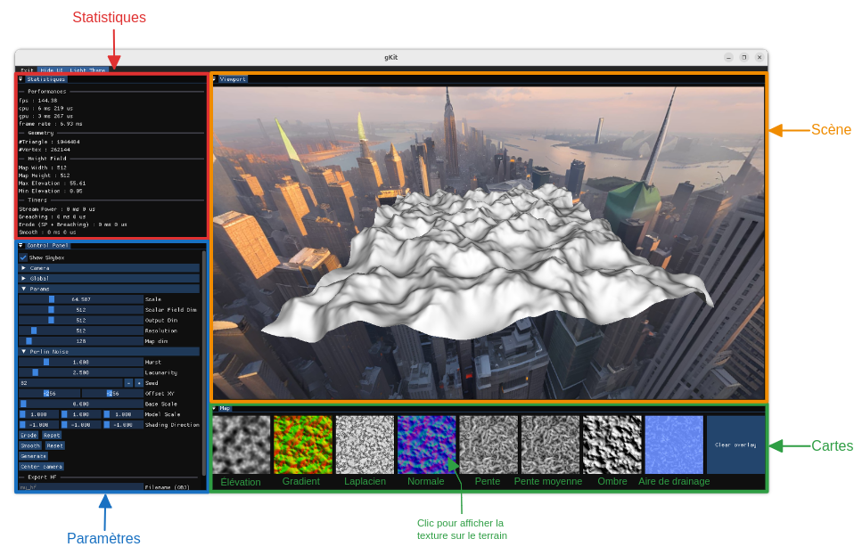

<a id="readme-top"></a>
<details>
  <summary>Sommaire</summary>
  <ol>
    <li>
      <a href="#about-the-project">À propos</a>
      <ul>
        <li><a href="#goals">Objectifs</a></li>
        <li><a href="#structure">Structure du projet</a></li>
        <li><a href="#libraries">Librairies utilisées</a></li>
      </ul>
    </li>
    <li>
      <a href="#getting-started">Compiler le projet</a>
      <ul>
        <li><a href="#prerequisites">Prérequis</a></li>
        <li><a href="#installation">Installation</a></li>
        <li><a href="#build">Build & exécution</a></li>
      </ul>
    </li>
    <li>
      <a href="#application">Application</a>
    </li>
  </ol>
</details>

<p align="right">(<a href="#readme-top">back to top</a>)</p>

<a id="about-the-project"></a>

## À propos

Ce projet a été réalisé dans le cadre de l'unité d'enseignement "Modélisation de Mondes Virtuels" en Master 2 ID3D à l'Université Claude Bernard Lyon 1, Villeurbanne.    

<p align="right">(<a href="#readme-top">back to top</a>)</p>

<a id="goals"></a>

### Objectifs

<a id="structure"></a>

### Structure du projet 

```
  ├── data                  
  |   ├── obj                 # Les maillages sont sauvegardés ici. 
  |   └── shaders             # Shaders utilisés pour le rendu avec GKit.
  ├── src                   # Code 
  |   ├── Include             # Fichiers .h.  
  |   |   └── ...
  |   ├── Source              # Fichiers .cpp.  
  |   |   └── ...
  |   ├── CMakeLists.txt      # Fichier de configuration CMake. 
  |   └── main.cpp              
  ├── vendor 
  |   ├── exprtk # Exprtk lib
  |   ├── gkit   # Gkit lib
  |   └── imgui  # ImGUI lib
  ├── .gitignore            # Fichier .gitignore.
  ├── CMakeLists.txt        # Configuration Cmake.
  ├── imgui.ini             # Configuration ImGui.
  └── README.md             # Fichier README du projet.
```

<p align="right">(<a href="#readme-top">back to top</a>)</p>

<a id="libraries"></a>

### Librairies utilisées

Le projet est en C++. Les librairies utilisées sont listées ci-dessous : 

* [GKit](https://perso.univ-lyon1.fr/jean-claude.iehl/Public/educ/M1IMAGE/html/index.html) : Utilisé pour visualiser les maillages générés. 
* [ImGUI](https://github.com/ocornut/imgui) : Utilisé pour gérer l'UI de l'application.
* [exprtk - C++ Mathematical Expression Toolkit Library](https://github.com/ArashPartow/exprtk) : Utilisé pour parser une chaînes de caractères en une expression arithmétique.

Ces librairies sont accessibles dans le répertoire *vendor*. 

<p align="right">(<a href="#readme-top">back to top</a>)</p>

<a id="getting-started"></a>

## Compiler le projet

Ce projet ne compile que sous Linux. 

<p align="right">(<a href="#readme-top">back to top</a>)</p>

<a id="prerequisites"></a>

### Prérequis

GKit utilise SDL2 et Glew :  
```sh
sudo apt install libsdl2-dev libsdl2-image-dev libglew-dev
```

<p align="right">(<a href="#readme-top">back to top</a>)</p>

<a id="installation"></a>

### Installation

1. Cloner le dépôt 
```sh
git clone https://github.com/tgrillon/mmv.git
```

<p align="right">(<a href="#readme-top">back to top</a>)</p>

<a id="build"></a>

### Build & exécution

1. Build le projet avec cmake : 
    ```sh
    cmake -B build -DCMAKE_BUILD_TYPE=Release && cmake --build build/ -t mmv -j 12
    ```
2. Lancer l'application :
    ```sh
    ./build/mmv 
    ```
<p align="right">(<a href="#readme-top">back to top</a>)</p>

<a id="application"></a>

## Application

L'application utilise ImGui qui permet d'avoir une interface modulable avec des fenêtres dockables : 


### Fonctionnalités globales


